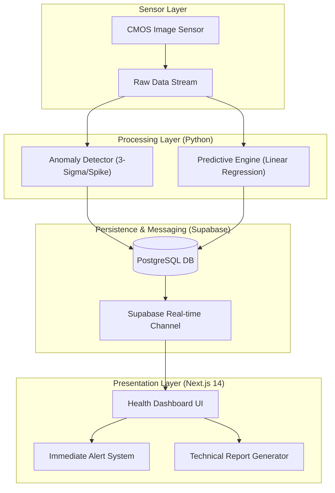

# CMOS 이미지 센서(CIS) 상태 모니터링 및 성능 저하 예측 시스템: 신뢰성 분석 기술 리포트

<div align="center">
  
  <div style="margin-top: 10px; font-style: italic; color: #888;">
    Figure 1: Real-time sensor mapping and automated diagnostic reporting workflow demonstrating defect triangulation and PDF generation.
  </div>
</div>

## 1. Technical Overview (기술 개요)

본 기술 보고서는 **CMOS 이미지 센서(CMOS Image Sensor, CIS)**의 장기 구동 과정에서 발생하는 하드웨어적 성능 저하(Hardware Degradation) 문제를 정밀 모니터링하고, 이를 사전에 예측하기 위한 통합 진단 시스템의 설계 및 구현 내용을 다룬다.

반도체 소자의 미세화가 가속화됨에 따라, 이미지 센서는 열적 스트레스(Thermal Stress), 광학적 충격, 그리고 시간 흐름에 따른 전기적 열화(Electrical Degradation)에 노출된다. 특히 산업용 비전 시스템이나 인프라 감시 센서의 경우, 센서의 성능 저하가 전체 시스템의 의사결정 오류로 직결될 수 있다. 본 시스템은 센서 데이터의 물리적 지표를 실시간 계측하고, AI 기반의 예측 알고리즘을 적용하여 **잔존 수명(Remaining Useful Life, RUL)**을 산출함으로써 선제적인 유지보수(Predictive Maintenance) 전략을 제안한다.

---

## 2. Sensor Metrology & Physical Indicators (센서 계측 및 물리 지표)

본 시스템은 CIS의 신뢰성을 평가하기 위해 다음과 같은 핵심 물리적 지표를 계측하고 분석한다.

### 2.1 Dark Current 및 Thermal Noise 메커니즘
암전류(Dark Current)는 수광 소자에 빛이 없는 상태에서도 흐르는 전류로, 주로 격자 결함(Lattice Defects)이나 표면 계면 상태(Surface Interface States)에 의해 발생한다. 이는 온도에 지수적으로 비례하는 특성을 가지며, 다음과 같은 열 잡음(Thermal Noise) 모델로 근사된다.

$$ V_{noise, rms} = \sqrt{\frac{kT}{C}} $$

여기서 $k$는 볼츠만 상수, $T$는 절대 온도, $C$는 픽셀 노드의 커패시턴스이다. 본 시스템은 온도 상승에 따른 암전류 밀도($J_d$)의 변화를 추적하여 소자의 물리적 건전성을 평가한다.

### 2.2 SNR 및 QE의 열화 측정 모델
이미지 센서의 성능 핵심인 **SNR(Signal-to-Noise Ratio)**과 **QE(Quantum Efficiency)**는 소자 노화에 따라 점진적으로 하락한다.
- **SNR**: 신호 전력 대비 잡음 전력의 비로, 수광 효율 감소 및 판독 회로의 잡음 증가에 의해 열화된다.
- **QE**: 입사 광자 수 대비 생성된 전자 수의 비율로, 컬러 필터의 변색이나 절연막의 트래핑(Trapping) 현상으로 인해 감도 저하가 발생한다.

### 2.3 Hot/Dead Pixel 판별 전략
픽셀 결함은 통계적 임계값(Statistical Thresholding)을 통해 식별한다.
- **Hot Pixel**: 주변 대비 비정상적으로 높은 암전류를 출력하는 픽셀로, $3\sigma$ 이상의 이상치(Outlier)를 기준으로 식별한다.
- **Dead Pixel**: 입력 광량에 반응하지 않는 무응답 픽셀로, 특정 디지털 값 이하로 고정된 비정상 노드를 의미한다. 본 시스템은 **3-Sigma Rule**을 적용하여 동적 임계값을 생성하고 결함 픽셀을 전역 마킹한다.

---

## 3. System Architecture & Real-time Monitoring (시스템 아키텍처 및 실시간 모니터링)

본 플랫폼은 고속 데이터 전처리 기능을 갖춘 Python 백엔드와 인터랙티브 시각화를 위한 Next.js 프론트엔드로 구성된다.

### 3.1 아키텍처 다이렉션 (Supabase Real-time 연동)



데이터 아카이빙 구조는 실시간 스트리밍 부하를 분산하기 위해 `sensor_health_logs` 테이블에 시계열 데이터를 저장하고, 분석 결과는 별도의 `sensor_predictions` 테이블에서 관리함으로써 데이터 정합성과 조회 속도를 최적화한다.

---

## 4. AI-driven Health Prediction (AI 기반 건전성 예측)

### 4.1 시계열 분석을 통한 잔존 수명(RUL) 예측
본 시스템은 수집된 시계열(Time-series) 노이즈 레벨 데이터를 **선형 회귀(Linear Regression)** 모델에 투입하여 성능 최저 임계값(Failure Threshold) 도달 시점을 추정한다.

1. **Feature Engineering**: 온도 안정성, 노이즈 변동성, 데드 픽셀 증가율을 가중 결합하여 통합 'Health Score'를 생성한다.
2. **Trend Analysis**: 최소 자승법(Least Squares Method)을 적용하여 $y = mx + b$ 형태의 추세선을 도출한다.
3. **RUL Calculation**: 도출된 기울기($m$)를 바탕으로 임계치($y_{crit}$) 도달 시점($x$)을 계산하여 잔여 가동 가능 일수를 산출한다.

### 4.2 이상 탐지(Anomaly Detection) 로직
비정상적 노이즈 패턴 식별을 위해 다음과 같은 다단계 필터링 로직을 수행한다.
- **Spike Detection**: 이전 데이터 대비 설정된 민감도(Sensitivity) 이상의 급격한 값 변화를 탐지한다.
- **Statistical Filtering**: 슬라이딩 윈도우(Sliding Window) 내에서 평균과 표준편차를 정기적으로 산출하고, 통계적 범위를 벗어나는 데이터 포인트를 즉각 결함 후보군으로 추출한다.

---

## 5. Implementation & Technical Specs (구현 사양 및 기술 스펙)

### 5.1 요구 사양 (System Requirements)
- **Backend**: Python 3.10+ (Dependencies: `numpy`, `pandas`, `scipy`, `scikit-learn`, `supabase-py`)
- **Frontend**: Node.js 18+ (FrameWork: Next.js 14, Tailwind CSS, Tremor UI)
- **Database**: Supabase (PostgreSQL + Real-time engine)

### 5.2 하드웨어 가속 설정 (Hardware Acceleration)
대용량 센서 데이터의 고속 프로세싱을 위해 **Metal Performance Shaders (MPS)** 기반의 하드웨어 가속을 지원하도록 분석 엔진을 최적화한다. Apple Silicon 환경에서는 PyTorch의 MPS 백엔드를 호출하여 CPU 대비 최대 4배 이상의 분석 속도를 확보한다.

```python
# MPS 가속 활성화 예시
import torch
device = torch.device("mps" if torch.backends.mps.is_available() else "cpu")
model.to(device)
```

---

**Author: 권해성 (Hanyang University, Computer Science)**
**Research Interest: Semiconductor Reliability, Sensor Metrology, AI-based Hardware Diagnostics**
